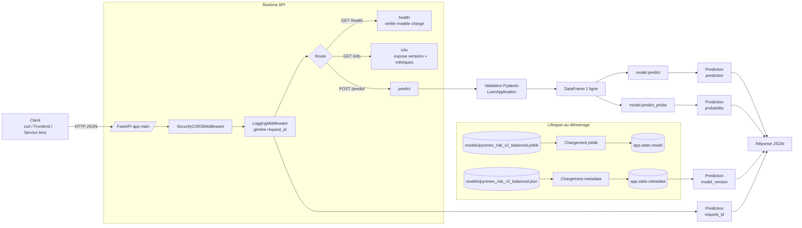

## 🎯 Introduction du module

Ce module implémente une API FastAPI de scoring crédit pour servir le modèle
Pyrenex Risk v2 (`joblib` + métadonnées `json`) entraîné en M1-B1.

Objectifs principaux :

- Exposer une API de prédiction stable et testable (`/predict`)
- Fournir des endpoints d'observabilité (`/health`, `/info`)
- Emballer l'application dans un conteneur Docker reproductible
- Retourner une réponse métier claire (classe + probabilité + version modèle + `request_id`)

## 🧩 Architecture d'appel (Client -> API -> Modèle)



## 🚀 Démarrage rapide (3 commandes)

```bash
docker build -t pyrenex-risk-api:local .
docker run --rm -p 8000:8000 --name pyrenex-risk-api pyrenex-risk-api:local
curl http://localhost:8000/health
```

Résultat attendu pour `/health` :

```json
{"status":"ok"}
```

## 🔮 Exemple complet d'appel `/predict`

```bash
curl -X POST http://localhost:8000/predict \
   -H "Content-Type: application/json" \
   -d '{
      "loan_amnt": 12000,
      "term": "36 months",
      "int_rate": 12.5,
      "installment": 401.56,
      "annual_inc": 55000,
      "dti": 18.2,
      "delinq_2yrs": 0,
      "fico_range_low": 690,
      "revol_util": 42.1,
      "grade": "B",
      "home_ownership": "RENT",
      "verification_status": "Verified",
      "purpose": "debt_consolidation",
      "emp_length": "5 years"
   }'
```

Exemple de réponse :

```json
{
   "prediction": 0,
   "probability": 0.1734,
   "model_version": "2.0.0",
   "request_id": "a0d95f17-9f1b-4c79-b57b-74f6052e7fd6"
}
```

Interprétation :

- `prediction = 0` : prêt prédit comme bon payeur
- `prediction = 1` : prêt prédit comme mauvais payeur (défaut)
- `probability` : probabilité de défaut (classe 1)

## 🏷️ Version API et modèle (`/info`)

Commande :

```bash
curl http://localhost:8000/info
```

Exemple de réponse :

```json
{
   "api_version": "0.1.0",
   "model_name": "pyrenex_risk_v2_balanced",
   "model_version": "2.0.0",
   "model_created_at": "2026-06-01T10:45:00Z",
   "metrics_holdout": {
      "roc_auc": 0.79,
      "f1": 0.52,
      "precision": 0.58,
      "recall": 0.47
   }
}
```

Champs retournés par `/info` :

- `api_version` : version de l'API FastAPI
- `model_name` : nom du modèle chargé au démarrage
- `model_version` : version sémantique du modèle
- `model_created_at` : horodatage de création/packaging du modèle
- `metrics_holdout` : métriques d'évaluation du modèle sur holdout

---

## 📁 Structure du repo

```
M1-B2-scoring-api-<prenom>/
├── app/
│   ├── __init__.py
│   ├── main.py                  # FastAPI app + lifespan + routes
│   ├── schemas.py               # Pydantic schemas (LoanApplication, Prediction)
│   └── middleware.py            # LoggingMiddleware Loguru
├── tests/
│   ├── __init__.py
│   ├── conftest.py              # fixtures pytest (client + valid_payload)
│   ├── test_model_contract.py   # test 0 — valide le .joblib avant l'API
│   └── test_api.py              # tests routes /health, /info, /predict
├── models/                      # ton .joblib + .json depuis M1-B1
│   └── .gitkeep
├── logs/                        # logs rotatifs (gitignored)
│   └── .gitkeep
├── ressources/                  # 📚 mini-cours d'appui (lecture juste-à-temps)
│   ├── 01_FastAPI_Pydantic_ml_essentiel.md
│   ├── 02_Dockerfile_Python_essentiel.md
│   ├── 03_Pytest_TestClient_essentiel.md
│   ├── 04_Loguru_middleware_essentiel.md
│   ├── 05_Versionning_modele_essentiel.md
│   ├── liens_officiels.md
│   └── README.md                # ordre de mobilisation + objectifs
├── Dockerfile                   # à compléter (cf. ressources/02)
├── .dockerignore
├── .gitignore
├── requirements.txt
└── README.md (ce fichier — à compléter avec schéma Mermaid + démarrage)
```
